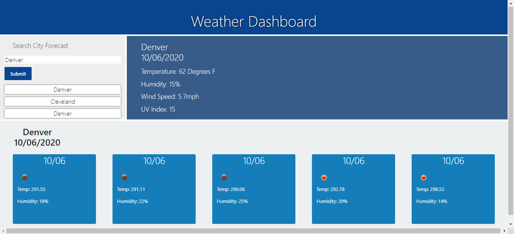

# Weather Dashboard

## Table of Contents

- **[Description](#Description)**
- **[Installation Requirements](#Installation-Requirements)**
- **[Usage](#Usage)**
- **[License](#License)**
- **[Contributors](#Contributors)**
- **[Tests](#Tests)**
- **[Questions](#Questions)**

# Description

Using [OpenWeather API](https://openweathermap.org/api) I am retrieving weather data for cities entered in the search bar. Denver is the default city populated. As a user, I want to search for a city and I need to be presented with current weather conditions, temperature, humidity and wind speed. The web app is built on Node to act as a server side API. 

# Installation Requirements

1. Clone repo by entering in the CLI: git clone https://github.com/sallamy2580/weather-report.git

# License

MIT

# Have Questions?

## [Github Profile: github.com/sallamy2580](https://github.com/sallamy2580 "Title")

Please email me at polarisfar7@gmail.com if you have additional questions.
